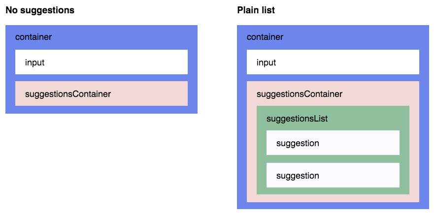

# AddressLookup Component

The AddressLookup component is a React UI component that provides address auto suggest functionality through the Canada Post API service. The component is designed to be 

## Features

* [WAI-ARIA compliant](https://rawgit.com/w3c/aria-practices/master/aria-practices-DeletedSectionsArchive.html#autocomplete), with support for ARIA attributes and keyboard interactions
* Mobile friendly
* Plugs in nicely to Flux and [Redux](http://redux.js.org) applications
* Full control over [suggestions rendering](#render-suggestion-prop)
* [Highlight the first suggestion](#highlight-first-suggestion-prop) in the list if you wish
* Supports styling using [CSS Modules](https://github.com/css-modules/css-modules), [Radium](https://github.com/FormidableLabs/radium), [Aphrodite](https://github.com/Khan/aphrodite), [JSS](https://github.com/cssinjs/jss), [and more](#theme-prop)
* [Always render suggestions](#always-render-suggestions-prop) (useful for mobile and modals)
* [Pass through arbitrary props to the input](#input-props-prop) (e.g. placeholder, type, [onChange](#input-props-on-change), [onBlur](#input-props-on-blur), or any other), or [take full control on the rendering of the input](#render-input-component-prop) (useful for integration with other libraries)

## Installation

### None: installation will not work at the moment as the component is not deployed to the repository.

```shell
yarn add address-lookup
```

or

```shell
npm install address-lookup --save
```

## Basic Usage

```js
import React, { Component } from 'react';
import AddressLookup from "address-lookup";

class Example extends Component {
  
  constructor(props){
    super(props);
    this.state = {
      value: "",
      selectedAddress: "",
      selectedCity: "",
      selectedPostalCode: "",
      selectedProvince: "",
      selectedCountry: ""
    };
  }

  renderSuggestion = (suggestion, { query, isHighlighted }) => {
    return (
        <div>{suggestion.addressText}</div>
      );
  }

  onChange = (event, { newValue, method }) => {
    this.setState({
      value: newValue
    });
  };

  onAddressSelected = (addressText, city, postalCode, province, country, addressID, selectionMethod) => {
    this.setState({
      value: [addressText, postalCode, province].join(", "),
      selectedAddress: addressText,
      selectedCity: city,
      selectedPostalCode: postalCode,
      selectedProvince: province,
      selectedCountry: country
    })
  }

  render() {
    const theme = {
      container:                'address-lookup__container',
      containerOpen:            'address-lookup__container--open',
      input:                    'address-lookup__input',
      inputOpen:                'address-lookup__input--open',
      inputFocused:             'address-lookup__input--focused',
      suggestionsContainer:     'address-lookup__suggestions-container',
      suggestionsContainerOpen: 'address-lookup__suggestions-container--open',
      suggestionsList:          'address-lookup__suggestions-list',
      suggestion:               'address-lookup__suggestion',
      suggestionFirst:          'address-lookup__suggestion--first',
      suggestionHighlighted:    'address-lookup__suggestion--highlighted',
      sectionContainer:         'address-lookup__section-container',
      sectionContainerFirst:    'address-lookup__section-container--first',
      sectionTitle:             'address-lookup__section-title'
    }
    
    return (
      <div className="App">
        <header className="App-header">
          <AddressLookup
            inputPlaceholder="Enter an address..." 
            renderSuggestion={this.renderSuggestion}
            onAddressSelected={this.onAddressSelected}
            language="ENG"
            value={this.state.value}
            onChange={this.onChange}
            theme={theme}
          />
        </header>
      </div>
    );
  }
}
```

## Props

| Prop | Type | Required | Description |
| :--- | :--- | :---: | :--- |
| [`renderSuggestion`](#render-suggestion-prop) | Function | ✓ | render the autosuggest address. |
| [`onAddressSelected`](#on-address-selected-prop) | Function | | Will be called every time an address is selected via mouse or keyboard. |
| [`onChange`](#props-on-change) | Function | ✓ | Will be called everytime the input is changed. |
| [`onBlur`](#props-on-blur) | Function | ✓ | Will be called everytime the input lost the focus. |
| [`onAddressHighlighted`](#on-address-highlighted-prop) | Function | | Will be called every time the highlighted suggestion changes. |
| [`alwaysRenderSuggestions`](#always-render-suggestions-prop) | Boolean | | Set it to `true` if you'd like to render suggestions even when the input is not focused. |
| [`highlightFirstSuggestion`](#highlight-first-suggestion-prop) | Boolean | | Set it to `true` if you'd like Autosuggest to automatically highlight the first suggestion. |
| [`focusInputOnSuggestionClick`](#focus-input-on-suggestion-click-prop) | Boolean | | Set it to `false` if you don't want Autosuggest to keep the input focused when suggestions are clicked/tapped. |
| [`renderInputComponent`](#render-input-component-prop) | Function | | Use it only if you need to customize the rendering of the input. |
| [`renderSuggestionsContainer`](#render-suggestions-container-prop) | Function | | Use it if you want to customize things inside the suggestions container beyond rendering the suggestions themselves. |
| [`theme`](#theme-prop) | Object | | Pass the css classes to style the component. |
| [`id`](#id-prop) | String | | Useed to identify the object, mandatory if you have multiple Addresslookup components on the same page. |

<a name="render-suggestion-prop"></a>
#### renderSuggestion (required)

Use your imagination to define how suggestions are rendered.

The signature is:

```js
function renderSuggestion(suggestion, { query, isHighlighted })
```

where:

* `suggestion` - The suggestion to render
* `query` - Used to highlight the matching string. As user types in the input, `query` will be equal to the trimmed value of the input. Then, if user interacts using the <kbd>Up</kbd> or <kbd>Down</kbd> keys, [the input will get the value of the highlighted suggestion](https://rawgit.com/w3c/aria-practices/master/aria-practices-DeletedSectionsArchive.html#autocomplete), but `query` will remain to be equal to the trimmed value of the input prior to the <kbd>Up</kbd> and <kbd>Down</kbd> interactions.
* `isHighlighted` - Whether or not the suggestion is highlighted.

It should return a string or a `ReactElement`. For example:

```js
function renderSuggestion(suggestion) {
  return (
    <span>{suggestion.text}</span>
  );
}
```

**Important:** `renderSuggestion` must be a pure function (rendering performance is optimized based on this assumption).

<a name="props-on-change"></a>
##### onChange (required)

The signature is:

```js
function onChange(event, { newValue, method })
```

where:

* `newValue` - the new value of the input
* `method` - string describing how the change has occurred. The possible values are:
  * `'down'` - user pressed <kbd>Down</kbd>
  * `'up'` - user pressed <kbd>Up</kbd>
  * `'escape'` - user pressed <kbd>Escape</kbd>
  * `'enter'` - user pressed <kbd>Enter</kbd>
  * `'click'` - user clicked (or tapped) on suggestion
  * `'type'` - none of the methods above (usually means that user typed something, but can also be that they pressed Backspace, pasted something into the input, etc.)

<a name="props-on-blur"></a>
##### onBlur (optional)

The signature is:

```js
function onBlur(event, { highlightedSuggestion })
```

where:

* `highlightedSuggestion` - the suggestion that was highlighted just before the input lost focus, or `null` if there was no highlighted suggestion.

<a name="on-address-selected-prop"></a>
#### onAddressSelected (optional)

This function is called when address is selected. It has the following signature:

```js
function onSuggestionSelected(addressText, city, postalCode, province, country, addressID, selectionMethod })
```

where:

* `addressText` - the selected street address
* `city` - the selected city
* `postalCode` - the selected postal code
* `province` - the selected province
* `country` - the selected country
* `addressID` - the id of the selected address as returned by the address service provider
* `selectionMethod` - string describing how user selected the suggestion. The possible values are:
  * `'click'` - user clicked (or tapped) on the suggestion
  * `'enter'` - user selected the suggestion using <kbd>Enter</kbd>

<a name="on-address-highlighted-prop"></a>
#### onAddressHighlighted (optional)

This function is called when the highlighted address suggestion changes. It has the following signature:

```js
function onAddressHighlighted({ suggestion })
```

where:
* `suggestion` - the highlighted suggestion, or `null` if there is no highlighted suggestion.

<a name="always-render-suggestions-prop"></a>
#### alwaysRenderSuggestions (optional)

Set `alwaysRenderSuggestions={true}` if you'd like to always render the suggestions.

<a name="highlight-first-suggestion-prop"></a>
#### highlightFirstSuggestion (optional)

When `highlightFirstSuggestion={true}`, Autosuggest will automatically highlight the first suggestion. Defaults to `false`.

<a name="focus-input-on-suggestion-click-prop"></a>
#### focusInputOnSuggestionClick (optional)

By default, `focusInputOnSuggestionClick={true}`, which means that, every time suggestion is clicked (or tapped), the input keeps the focus.

On mobile devices, when the input is focused, the native keyboard appears. You'll probably want to lose the focus when suggestion is tapped in order to hide the keyboard.

You can do something like this:

```xml
<Autosuggest focusInputOnSuggestionClick={!isMobile} ... />
```

where `isMobile` is a boolean describing whether Autosuggest operates on a mobile device or not. You can use [kaimallea/isMobile](https://github.com/kaimallea/isMobile), for example, to determine that.

<a name="render-input-component-prop"></a>
#### renderInputComponent (optional)

You shouldn't specify `renderInputComponent` unless you want to customize the rendering of the input.

To keep Autosuggest [accessible](https://rawgit.com/w3c/aria-practices/master/aria-practices-DeletedSectionsArchive.html#autocomplete), `renderInputComponent` MUST:

* render an input
* pass through all the provided `inputProps` to the input

Example:

```js
const renderInputComponent = inputProps => (
  <div>
    <input {...inputProps} />
    <div>custom stuff</div>
  </div>
);

```

**Note:** When using `renderInputComponent`, you still need to specify the usual [`inputProps`](#input-props-prop). Autosuggest will merge the `inputProps` that you provide with other props that are needed for accessibility (e.g. `'aria-activedescendant'`), and will pass the **merged `inputProps`** to `renderInputComponent`.

<a name="render-suggestions-container-prop"></a>
#### renderSuggestionsContainer (optional)

You shouldn't specify `renderSuggestionsContainer` unless you want to customize the content or behaviour of the suggestions container beyond rendering the suggestions themselves. For example, you might want to add a custom text before/after the suggestions list, or to [customize the scrolling behaviour of the suggestions container](https://github.com/moroshko/react-autosuggest/blob/master/FAQ.md#limitSuggestionsContainerScrolling).

The signature is:

```js
function renderSuggestionsContainer({ containerProps, children, query })
```

where:

* `containerProps` - props that you MUST pass to the topmost element that is returned from `renderSuggestionsContainer`.
* `children` - the suggestions themselves. It's up to you where to render them.
* `query` - Same as `query` in [`renderSuggestion`](#render-suggestion-prop).

For example:

```js
function renderSuggestionsContainer({ containerProps , children, query }) {
  return (
    <div {... containerProps}>
      {children}
      <div>
        Press Enter to search <strong>{query}</strong>
      </div>
    </div>
  );
}
```

When `renderSuggestionsContainer` returns a composite component (e.g. `<IsolatedScroll ... />` as opposed to a DOM node like `<div ... />`), you MUST call `containerProps.ref` with the topmost element that the composite component renders.

For example:

```js
import IsolatedScroll from 'react-isolated-scroll';

function renderSuggestionsContainer({ containerProps, children }) {
  const { ref, ...restContainerProps } = containerProps;
  const callRef = isolatedScroll => {
    if (isolatedScroll !== null) {
      ref(isolatedScroll.component);
    }
  };

  return (
    <IsolatedScroll ref={callRef} {...restContainerProps}>
      {children}
    </IsolatedScroll>
  );
}
```

<a name="theme-prop"></a>
#### theme (optional)

Autosuggest comes with no styles.

It uses [react-themeable](https://github.com/markdalgleish/react-themeable) that allows you to style your Autosuggest component using [CSS Modules](https://github.com/css-modules/css-modules), [Radium](https://github.com/FormidableLabs/radium), [Aphrodite](https://github.com/Khan/aphrodite), [JSS](https://github.com/cssinjs/jss), [Inline styles](https://facebook.github.io/react/docs/dom-elements.html#style), and global CSS.

For example, to style the Autosuggest using CSS Modules, do:

```css
/* theme.css */

.container { ... }
.input { ... }
.suggestionsContainer { ... }
.suggestion { ... }
.suggestionHighlighted { ... }
...
```

```js
import theme from 'theme.css';
```
```xml
<Autosuggest theme={theme} ... />
```

When not specified, `theme` defaults to:

```js
{
  container:                'address-lookup__container',
  containerOpen:            'address-lookup__container--open',
  input:                    'address-lookup__input',
  inputOpen:                'address-lookup__input--open',
  inputFocused:             'address-lookup__input--focused',
  suggestionsContainer:     'address-lookup__suggestions-container',
  suggestionsContainerOpen: 'address-lookup__suggestions-container--open',
  suggestionsList:          'address-lookup__suggestions-list',
  suggestion:               'address-lookup__suggestion',
  suggestionFirst:          'address-lookup__suggestion--first',
  suggestionHighlighted:    'address-lookup__suggestion--highlighted',
  sectionContainer:         'address-lookup__section-container',
  sectionContainerFirst:    'address-lookup__section-container--first',
  sectionTitle:             'address-lookup__section-title'
}
```

The following picture illustrates how `theme` keys correspond to Autosuggest DOM structure:



<a name="id-prop"></a>
#### id (required when multiple Autosuggest components are rendered on a page)

The only reason `id` exists, is to set ARIA attributes (they require a unique id).

When rendering a single Autosuggest, don't set the `id` (it will be set to `'1'`, by default).

When rendering multiple Autosuggest components on a page, make sure to give them unique `id`s. For example:

```xml
<Autosuggest id="source" ... />
<Autosuggest id="destination" ... />
```